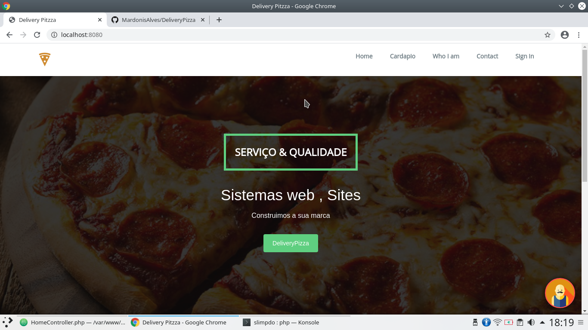
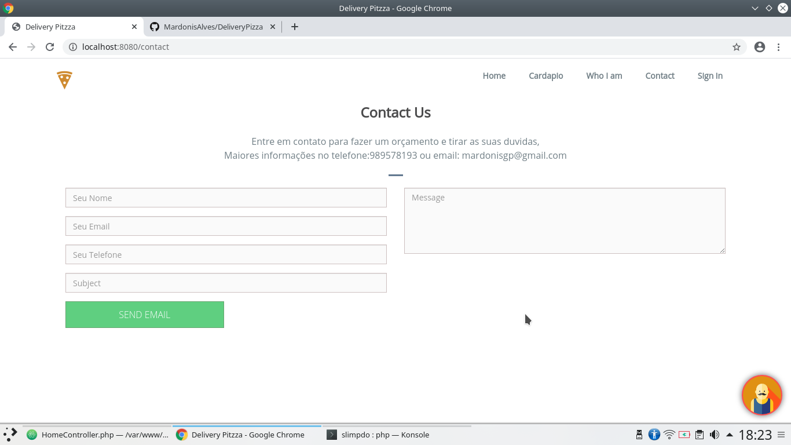

#DeliveryPizza
<h3>Slim Microframework</h3>

    Neste pequeno projeto utilizaremos o Slim Framework php para o nosso back-end
    e no front-end bootstrap e a nossa view com o twig mantido pela sinfony. Lembrando que
    Vocẽ deve ter instalado na maquina o composer o gerenciador de dependecia do php.
    Veja como instalar aqui <a href="https://getcomposer.org/doc/00-intro.md#installation-linux-unix-macos">Composer / linux / Mec / Windows</a>

<ul>
    <li>Slim framework</li>
    <li>slim/twig-view</li>
    <li> slim/flash </li>

</ul>

<a href="http://www.slimframework.com/docs/v3/tutorial/first-app.html">Slim Documentação</a> 
Para instalar o slim: 
composer require slim/slim "^3.0"

<a href="https://twig.symfony.com/doc/2.x/">Documentação Twig</a>

Para instalar o slim/twig-view
 

composer require Slim/twig-view

<a href="http://www.slimframework.com/docs/v3/features/flash.html">Slim/Flash</a> 
Para instalar o slim/flash

composer require slim/flash

<h3>Modulos em andamento</h3>
<h1>Pagina Home</h1>

<h1>pagina contato</h1>

# DeliveryPizza
